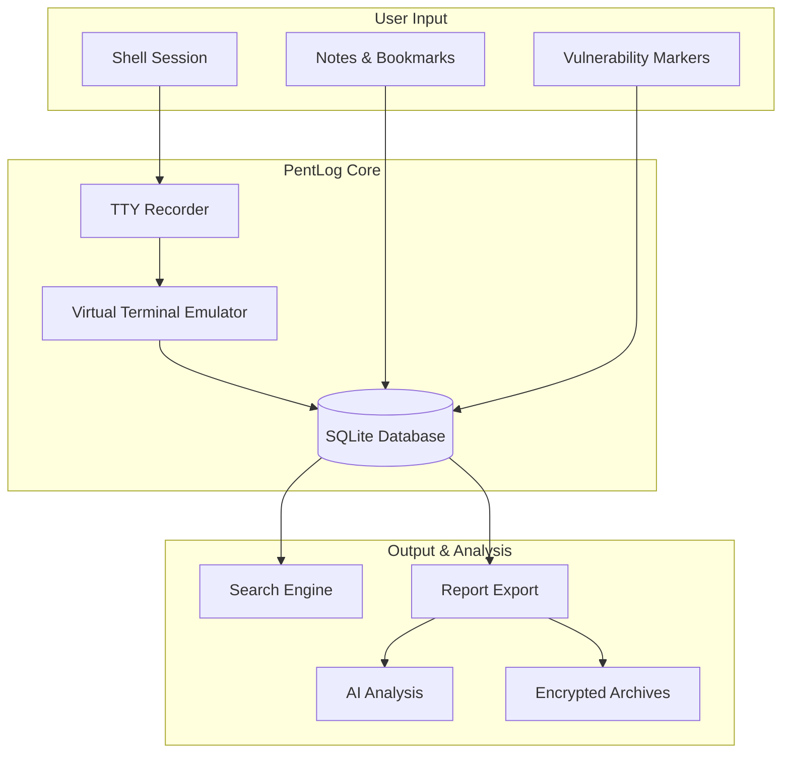

<!-- Hero Section -->
<div class="pentlog-hero">
  <div class="pentlog-hero__content">
    <div class="pentlog-hero__logo">
      <svg xmlns="http://www.w3.org/2000/svg" viewBox="0 0 24 24" fill="none" stroke="currentColor" stroke-width="2" stroke-linecap="round" stroke-linejoin="round">
        <rect x="3" y="11" width="18" height="11" rx="2" ry="2"></rect>
        <path d="M7 11V7a5 5 0 0 1 10 0v4"></path>
        <line x1="12" y1="16" x2="12" y2="16"></line>
      </svg>
    </div>
    <h1 class="pentlog-hero__title">PentLog</h1>
    <p class="pentlog-hero__tagline">
      Evidence-first pentest logging tool — Capture every command, find anything, prove everything.
    </p>
    <div class="pentlog-hero__badges">
      <span class="pentlog-hero__badge">
        <span class="twemoji">:octicons-terminal-16:</span>
        High-Fidelity Recording
      </span>
      <span class="pentlog-hero__badge">
        <span class="twemoji">:octicons-search-16:</span>
        Powerful Search
      </span>
      <span class="pentlog-hero__badge">
        <span class="twemoji">:octicons-shield-check-16:</span>
        Compliance Ready
      </span>
    </div>
    <div class="pentlog-hero__actions">
      <a href="getting-started/quickstart/" class="pentlog-hero__btn pentlog-hero__btn--primary">
        <span class="twemoji">:octicons-rocket-16:</span>
        Get Started
      </a>
      <a href="https://github.com/aancw/pentlog" class="pentlog-hero__btn pentlog-hero__btn--secondary" target="_blank">
        <span class="twemoji">:fontawesome-brands-github:</span>
        View on GitHub
      </a>
    </div>
  </div>
</div>

<!-- Stats Bar -->
<div class="stats-bar">
  <div class="stat-item">
    <div class="stat-value">5 min</div>
    <div class="stat-label">Quick Setup</div>
  </div>
  <div class="stat-item">
    <div class="stat-value">100%</div>
    <div class="stat-label">Terminal Fidelity</div>
  </div>
  <div class="stat-item">
    <div class="stat-value">AES-256</div>
    <div class="stat-label">Encryption</div>
  </div>
  <div class="stat-item">
    <div class="stat-value">∞</div>
    <div class="stat-label">Searchable History</div>
  </div>
</div>

## What is PentLog?

PentLog is a **professional terminal logging tool** designed for penetration testers, security researchers, and compliance auditors. It captures every command and output with perfect fidelity, making it easy to search, analyze, and report on your activities.

Built on `ttyrec` technology with a modern Virtual Terminal Emulator, PentLog preserves ANSI colors, cursor movements, and terminal state—giving you **perfect evidence** for client reports and compliance audits.

<div class="feature-grid">
  <div class="feature-card">
    <div class="feature-card__icon">
      <svg xmlns="http://www.w3.org/2000/svg" viewBox="0 0 24 24" fill="none" stroke="currentColor" stroke-width="2" stroke-linecap="round" stroke-linejoin="round">
        <circle cx="12" cy="12" r="10"></circle>
        <circle cx="12" cy="12" r="3"></circle>
      </svg>
    </div>
    <h3 class="feature-card__title">High-Fidelity Recording</h3>
    <p class="feature-card__desc">Capture every keystroke with Virtual Terminal Emulator. ANSI colors, cursor movements, and redraws preserved perfectly.</p>
  </div>
  <div class="feature-card">
    <div class="feature-card__icon">
      <svg xmlns="http://www.w3.org/2000/svg" viewBox="0 0 24 24" fill="none" stroke="currentColor" stroke-width="2" stroke-linecap="round" stroke-linejoin="round">
        <circle cx="11" cy="11" r="8"></circle>
        <path d="m21 21-4.35-4.35"></path>
        <path d="M11 8v6"></path>
        <path d="M8 11h6"></path>
      </svg>
    </div>
    <h3 class="feature-card__title">Powerful Search</h3>
    <p class="feature-card__desc">Find any command across all sessions instantly. Regex support, boolean operators (AND, OR, NOT), and live incremental search.</p>
  </div>
  <div class="feature-card">
    <div class="feature-card__icon">
      <svg xmlns="http://www.w3.org/2000/svg" viewBox="0 0 24 24" fill="none" stroke="currentColor" stroke-width="2" stroke-linecap="round" stroke-linejoin="round">
        <path d="M14 2H6a2 2 0 0 0-2 2v16a2 2 0 0 0 2 2h12a2 2 0 0 0 2-2V8z"></path>
        <polyline points="14 2 14 8 20 8"></polyline>
        <line x1="16" y1="13" x2="8" y2="13"></line>
        <line x1="16" y1="17" x2="8" y2="17"></line>
        <polyline points="10 9 9 9 8 9"></polyline>
      </svg>
    </div>
    <h3 class="feature-card__title">Compliance Reports</h3>
    <p class="feature-card__desc">Generate Markdown/HTML reports with integrity hashes, encrypted archives, and detailed audit trails ready for delivery.</p>
  </div>
  <div class="feature-card">
    <div class="feature-card__icon">
      <svg xmlns="http://www.w3.org/2000/svg" viewBox="0 0 24 24" fill="none" stroke="currentColor" stroke-width="2" stroke-linecap="round" stroke-linejoin="round">
        <rect x="3" y="3" width="18" height="18" rx="2" ry="2"></rect>
        <circle cx="8.5" cy="8.5" r="1.5"></circle>
        <polyline points="21 15 16 10 5 21"></polyline>
      </svg>
    </div>
    <h3 class="feature-card__title">AI Analysis</h3>
    <p class="feature-card__desc">Summarize findings with Google Gemini or local Ollama LLM. Get executive summaries and vulnerability insights automatically.</p>
  </div>
  <div class="feature-card">
    <div class="feature-card__icon">
      <svg xmlns="http://www.w3.org/2000/svg" viewBox="0 0 24 24" fill="none" stroke="currentColor" stroke-width="2" stroke-linecap="round" stroke-linejoin="round">
        <path d="M17 21v-2a4 4 0 0 0-4-4H5a4 4 0 0 0-4 4v2"></path>
        <circle cx="9" cy="7" r="4"></circle>
        <path d="M23 21v-2a4 4 0 0 0-3-3.87"></path>
        <path d="M16 3.13a4 4 0 0 1 0 7.75"></path>
      </svg>
    </div>
    <h3 class="feature-card__title">Live Sharing</h3>
    <p class="feature-card__desc">Share terminal sessions in real-time via browser. Viewers see full history with dark-themed xterm.js viewer.</p>
  </div>
  <div class="feature-card">
    <div class="feature-card__icon">
      <svg xmlns="http://www.w3.org/2000/svg" viewBox="0 0 24 24" fill="none" stroke="currentColor" stroke-width="2" stroke-linecap="round" stroke-linejoin="round">
        <path d="M12 22s8-4 8-10V5l-8-3-8 3v7c0 6 8 10 8 10z"></path>
        <path d="m9 12 2 2 4-4"></path>
      </svg>
    </div>
    <h3 class="feature-card__title">Crash Recovery</h3>
    <p class="feature-card__desc">Protect evidence from SSH disconnects, OOM kills, and unexpected crashes. Automatic heartbeat and stale session detection.</p>
  </div>
</div>

---

## Why PentLog?

### The Problem with Traditional Logging

Using `script`, `tmux`, or basic shell redirection during pentests creates **fragmented, unsearchable, unmaintainable evidence**:

| Issue | Impact |
|-------|--------|
| :material-close-circle:{ .red } **Lost commands** | Mixed with noise, impossible to extract context |
| :material-close-circle:{ .red } **No integrity** | How do you prove logs weren't tampered with? |
| :material-close-circle:{ .red } **Manual reports** | Hours spent copying/pasting into documents |
| :material-close-circle:{ .red } **Evidence gaps** | ANSI codes, terminal artifacts, overwrites break readability |
| :material-close-circle:{ .red } **Compliance nightmares** | No audit trails, no encrypted archives |

### How PentLog Solves It

| Solution | Benefit |
|----------|---------|
| :material-check-circle:{ .green } **Evidence-First Design** | Every command + output captured with perfect fidelity |
| :material-check-circle:{ .green } **Context & Metadata** | Automatic timestamps, operator tracking, client/engagement organization |
| :material-check-circle:{ .green } **Searchable Everything** | Find any command across all sessions with regex + boolean operators |
| :material-check-circle:{ .green } **Compliance-Ready** | Integrity hashes, AES-256 encrypted archives, detailed audit trails |
| :material-check-circle:{ .green } **Reports in Minutes** | Auto-generate Markdown/HTML with AI-powered summaries |

---

## Quick Start

Get PentLog running in under 5 minutes:

```bash title="Install PentLog"
# 1. Install (macOS/Linux)
curl -sSf https://raw.githubusercontent.com/aancw/pentlog/main/install.sh | sh

# 2. Setup dependencies
pentlog setup

# 3. Create your first engagement
pentlog create

# 4. Start recording
pentlog shell

# 5. Search and export
pentlog search
pentlog export
```

[:octicons-arrow-right-24: Installation Guide](getting-started/installation.md){ .md-button .md-button--primary }
[:octicons-arrow-right-24: Quick Start Tutorial](getting-started/quickstart.md){ .md-button }

---

## Who is PentLog For?

<div class="grid cards" markdown>

-   :material-bullseye-arrow:{ .lg .middle } __Penetration Testers__

    ---

    Capture every command during client engagements. Generate compliance-ready reports with perfect terminal fidelity. Organize by Client → Engagement → Phase.

-   :material-shield-check:{ .lg .middle } __Compliance Auditors__

    ---

    Maintain tamper-proof logs with integrity hashes. Create AES-256 encrypted archives for secure evidence delivery. Detailed audit trails for regulators.

-   :material-certificate:{ .lg .middle } __Certification Students__

    ---

    Document every step for OSCP, PNPT, HTB writeups. Search across sessions to find any command. Export clean Markdown reports instantly.

-   :material-incognito:{ .lg .middle } __Red Teamers__

    ---

    Record reproducible, timestamped sessions. Replay with exact timing. Share live sessions with teammates via browser.

</div>

---

## Architecture Overview



---

## Documentation Structure

<div class="grid" markdown>

-   **Getting Started**

    ---

    - [Installation](getting-started/installation.md)
    - [Quick Start](getting-started/quickstart.md)
    - [Core Concepts](getting-started/concepts.md)

-   **User Guide**

    ---

    - [Session Management](guide/sessions.md)
    - [Search & Analysis](guide/search.md)
    - [Notes & Bookmarks](guide/notes.md)
    - [Timeline & Replay](guide/timeline.md)
    - [Export & Reports](guide/export.md)
    - [AI Analysis](guide/ai-analysis.md)
    - [Live Sharing](guide/live-share.md)

-   **Advanced Topics**

    ---

    - [Archiving](advanced/archiving.md)
    - [Crash Recovery](advanced/crash-recovery.md)
    - [Configuration](advanced/configuration.md)
    - [Storage Layout](advanced/storage.md)

-   **Reference**

    ---

    - [CLI Commands](reference/commands.md)
    - [Tool Comparison](reference/comparison.md)

</div>

---

## Community & Support

<div class="grid cards" markdown>

-   :material-github: __GitHub Repository__

    ---

    Star us, report issues, and contribute to the project.

    [:octicons-arrow-right-24: github.com/aancw/pentlog](https://github.com/aancw/pentlog)

-   :material-bug: __Issue Tracker__

    ---

    Found a bug? Have a feature request? Let us know!

    [:octicons-arrow-right-24: Open an Issue](https://github.com/aancw/pentlog/issues)

-   :material-forum: __Discussions__

    ---

    Ask questions, share ideas, and connect with the community.

    [:octicons-arrow-right-24: Join Discussion](https://github.com/aancw/pentlog/discussions)

</div>

---

**Made for professionals. Evidence-first. No compromises.**

<script>
// Add entrance animation for feature cards
document.querySelectorAll('.feature-card').forEach((card, index) => {
  card.style.opacity = '0';
  card.style.transform = 'translateY(20px)';
  card.style.transition = 'opacity 0.5s ease, transform 0.5s ease';

  setTimeout(() => {
    card.style.opacity = '1';
    card.style.transform = 'translateY(0)';
  }, 100 + (index * 100));
});
</script>
